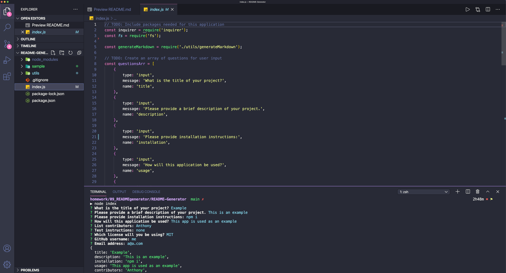
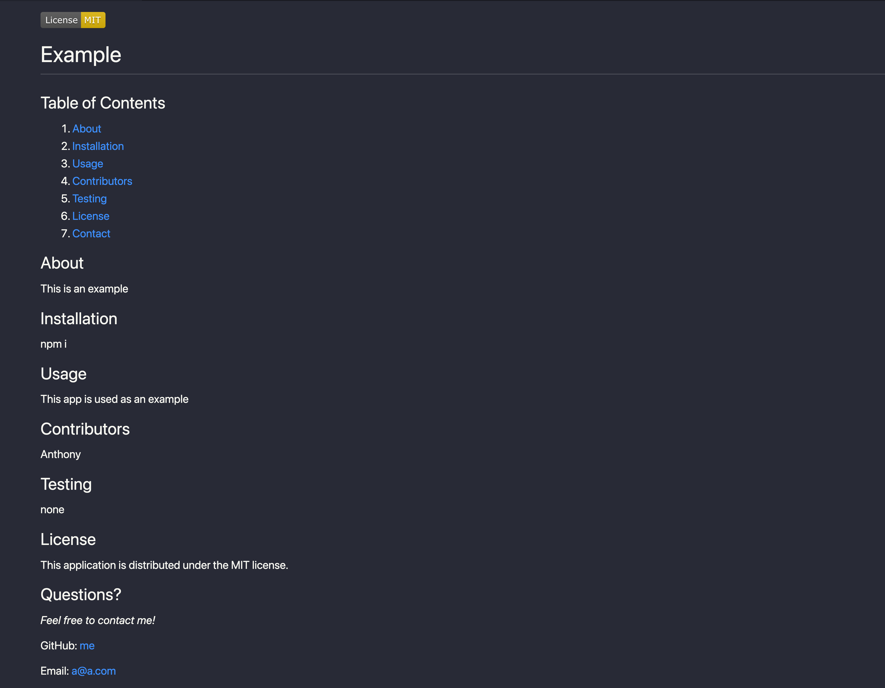

[](https://opensource.org/licenses/MIT)
<br />
<p align="center">
<svg xmlns="http://www.w3.org/2000/svg" width="80" height="80" fill="currentColor" class="bi bi-markdown" viewBox="0 0 16 16">
  <path d="M14 3a1 1 0 0 1 1 1v8a1 1 0 0 1-1 1H2a1 1 0 0 1-1-1V4a1 1 0 0 1 1-1h12zM2 2a2 2 0 0 0-2 2v8a2 2 0 0 0 2 2h12a2 2 0 0 0 2-2V4a2 2 0 0 0-2-2H2z"/>
  <path fill-rule="evenodd" d="M9.146 8.146a.5.5 0 0 1 .708 0L11.5 9.793l1.646-1.647a.5.5 0 0 1 .708.708l-2 2a.5.5 0 0 1-.708 0l-2-2a.5.5 0 0 1 0-.708z"/>
  <path fill-rule="evenodd" d="M11.5 5a.5.5 0 0 1 .5.5v4a.5.5 0 0 1-1 0v-4a.5.5 0 0 1 .5-.5z"/>
  <path d="M3.56 11V7.01h.056l1.428 3.239h.774l1.42-3.24h.056V11h1.073V5.001h-1.2l-1.71 3.894h-.039l-1.71-3.894H2.5V11h1.06z"/>
</svg>
  <h2 align="center">README Generator</h2>

  <p align="center">
    Builds quick, clean and professional README's 
    <br />
    <a href="https://github.com/anthonyapicella/README-Generator"><strong>Explore the repo »</strong></a>
    <br />
    <br />
    <a href="https://drive.google.com/file/d/1OM5JQvwXuEDaWV0VYzOmS12K3Dv4Djwf/view">Video Walkthrough</a>
    ·
    <a href="https://github.com/anthonyapicella/README-Generator/issues">Report Bug</a>
    ·
    <a href="https://github.com/anthonyapicella/README-Generator/issues">Request Feature</a>
  </p>
</p>


<!-- TABLE OF CONTENTS -->
<details open="open">
  <summary><h2 style="display: inline-block">Table of Contents</h2></summary>
  <ol>
    <li>
      <a href="#about-the-project">About The Project</a>
      <ul>
        <li><a href="#built-with">Built With</a></li>
      </ul>
    </li>
    <li>
      <a href="#getting-started">Getting Started</a>
      <ul>
        <li><a href="#prerequisites">Prerequisites</a></li>
        <li><a href="#installation">Installation</a></li>
      </ul>
    </li>
    <li><a href="#usage">Usage</a></li>
    <li><a href="#license">License</a></li>
    <li><a href="#contact">Contact</a></li>
  </ol>
</details>


<!-- ABOUT THE PROJECT -->
## About The Project
This is a simple CLI (Command Line Interface) application that helps the user quickly generate a clean and professional README for any given project :

>
>

### Built With

* JavaScript
* HTML
* [Node.js](https://nodejs.org/en/)
* [Inquirer.js](https://www.npmjs.com/package/inquirer)


<!-- GETTING STARTED -->
## Getting Started

To get a local copy up and running follow these simple steps.

### Prerequisites

* npm
  ```
  npm install npm@latest -g
  ```

### Installation

1. Clone the repo
   ```
   git clone https://github.com/anthonyapicella/README-Generator.git
   ```
2. Install NPM packages
   ```
   npm install
   ```

## Usage

In your terminal run:
```
node index
```
Answer each question and your .md will be generated automatically!

<!-- LICENSE -->
## License

Distributed under the [MIT](https://opensource.org/licenses/Apache-2.0) License. 

## Roadmap

* Integrate a more robust markdown template much like this one

<!-- CONTACT -->
## Contact

Anthony Apicella - anthony.apicella@me.com

[Repo Link](https://github.com/anthonyapicella/README-Generator)

[Video Walkthrough](https://drive.google.com/file/d/1OM5JQvwXuEDaWV0VYzOmS12K3Dv4Djwf/view)